# Lint & Security Workflow

Reusable GitHub Actions workflow for YAML linting and security scanning with shared configuration files.

## Features

- **YAML Linting**: Pre-commit hooks + yamllint validation
- **Auto-fix**: Automatically commits lint fixes via GitHub App
- **Security Scanning**: Checkov + Trivy with SARIF uploads
- **Helm Support**: Lint Helm charts with proper template exclusions
- **Shared Configs**: Organization-wide linting standards

## Quick Start

### Option 1: Use as Reusable Workflow (Recommended)

In your repository, create `.github/workflows/lint.yml`:

```yaml
name: Lint & Security

on:
  pull_request:
    paths:
      - '**.yaml'
      - '**.yml'
      - 'charts/**'

jobs:
  lint-and-security:
    uses: darkobas2/lint-test/.github/workflows/lint.yml@main
    permissions:
      contents: write
      pull-requests: write
      security-events: write
    with:
      # Use shared configs from this repo
      pre_commit_config_url: 'https://raw.githubusercontent.com/darkobas2/lint-test/main/.pre-commit-config.yaml'
      yamllint_config_url: 'https://raw.githubusercontent.com/darkobas2/lint-test/main/.yamllint'

      # Optional: Skip specific checks
      checkov_skip_checks: 'CKV_K8S_43,CKV_K8S_40'
      trivy_skip_dirs: '.git,.github,vendor'
    secrets:
      LINT_BOT_APP_ID: ${{ secrets.LINT_BOT_APP_ID }}
      LINT_BOT_PRIVATE_KEY: ${{ secrets.LINT_BOT_PRIVATE_KEY }}
```

### Option 2: Local Pre-commit Setup

Install pre-commit hooks for local development with **centralized config**:

```bash
# Install pre-commit (if not already installed)
pip install pre-commit

# Use the bootstrap config to auto-sync the shared config
curl -o .pre-commit-config.yaml https://raw.githubusercontent.com/darkobas2/lint-test/main/.pre-commit-config.bootstrap.yaml

# Install the git hooks
pre-commit install

# First run syncs the full shared config
pre-commit run --all-files

# Subsequent runs use the full shared config
pre-commit run --all-files
```

**✨ Auto-sync built-in:** The shared pre-commit config includes hooks that automatically fetch:
- Latest `.pre-commit-config.yaml` (syncs itself!)
- Latest `.yamllint` config
This ensures you're always using the organization's latest standards!

**📝 Note:** You can optionally add these to your `.gitignore` (they auto-sync on every run):
```gitignore
# Auto-synced configs - always fetch fresh
.yamllint
.pre-commit-config.yaml
```

Or commit them to your repo for offline use - they'll still auto-update when you run pre-commit.

## Configuration

### Workflow Inputs

| Input | Description | Default |
|-------|-------------|---------|
| `auto_fix` | Auto-commit lint fixes | `true` |
| `pre_commit_config_url` | Shared pre-commit config URL | `(this repo)` |
| `yamllint_config_url` | Shared yamllint config URL | `(this repo)` |
| `checkov_enabled` | Run Checkov security scanning | `true` |
| `checkov_skip_checks` | Comma-separated checks to skip | `''` |
| `checkov_framework` | Frameworks to scan | `kubernetes,helm,secrets` |
| `trivy_enabled` | Run Trivy security scanning | `true` |
| `trivy_skip_dirs` | Directories to skip | `.git,.github` |
| `helm_lint_enabled` | Run Helm chart linting | `true` |

### Security Enforcement

**Blocking is hardcoded** - security scans always fail on issues:
- Checkov: `soft_fail: false` (cannot be overridden)
- Trivy: Always blocks on CRITICAL/HIGH/MEDIUM

**Caller repos can configure**:
- Which checks to skip (`checkov_skip_checks`)
- Which directories to skip (`trivy_skip_dirs`)
- Which frameworks to scan (`checkov_framework`)

### Branch Protection Setup

Add these required status checks in your repo settings:

1. Go to **Settings → Branches → Branch protection rules**
2. Add rule for `main` branch
3. Enable "Require status checks to pass before merging"
4. Add required checks:
   - `lint-and-security / Lint & Format`
   - `lint-and-security / Helm Lint`
   - `lint-and-security / Security Scan` ⚠️ **Important!**
5. Enable "Require code scanning results"
6. Add required tools:
   - `Checkov`
   - `Trivy`

## GitHub App Setup (Optional)

For auto-fix commits, create a GitHub App:

1. **Settings → Developer settings → GitHub Apps → New App**
2. Configure:
   - Name: `lint-bot`
   - Permissions: `Contents: Read & Write`, `Pull Requests: Read & Write`
   - Install on organization/repos
3. Generate private key
4. Add secrets to your organization/repo:
   - `LINT_BOT_APP_ID`: App ID from settings
   - `LINT_BOT_PRIVATE_KEY`: Generated private key

Without GitHub App, the workflow uses `GITHUB_TOKEN` (limited permissions on protected branches).

## How It Works

### Workflow Execution Flow

```mermaid
graph TD
    A[PR Created/Updated] --> B{Last commit from lint-bot?}
    B -->|Yes| C[Skip Lint Job]
    B -->|No| D[Run Lint Job]
    D --> E[Pre-commit checks]
    E --> F{Changes needed?}
    F -->|Yes| G[Auto-commit fixes]
    F -->|No| H[Pass]
    G --> I[Security Scan]
    C --> I
    I --> J[Checkov + Trivy]
    J --> K{Issues found?}
    K -->|Yes| L[❌ Block Merge]
    K -->|No| M[✅ Pass]
```



### Loop Prevention

The workflow detects lint-bot commits and skips linting to prevent infinite loops:
- First run: User commit → Lint runs → Auto-fixes → Commits
- Second run: Bot commit → Lint skips → Security runs → Done

## Shared Configuration Files

### `.pre-commit-config.yaml`

Includes:
- **File hygiene**: trailing whitespace, end-of-file, large files, secrets
- **YAML**: yamllint + yamlfmt
- **Shell**: shellcheck
- **Markdown**: mdformat
- **Protection**: no direct commits to main/master

### `.yamllint`

Rules:
- 2-space indentation
- Helm template exclusions
- Flexible quoted strings
- No line length limits (yamlfmt handles formatting)

## Troubleshooting

### "Waiting for status to be reported"

**Cause**: Missing required status check in branch protection.

**Fix**: Add `lint-and-security / Security Scan` to required checks.

### Checkov finds no issues

**Possible causes**:
1. No YAML files changed in PR
2. All checks are skipped via `checkov_skip_checks`
3. Files are auto-fixed before Checkov runs

**Fix**: Check workflow logs and adjust skip checks.

### Infinite loop of auto-fixes

**Cause**: Bot detection failed or `[skip ci]` removed.

**Fix**: Workflow now detects bot commits by author name and commit message. Ensure you're using the latest version.

### Pre-commit fails locally but passes in CI

**Cause**: Outdated `.pre-commit-config.yaml` or missing tools.

**Fix**: Re-fetch the pre-commit config and reinstall:
```bash
curl -o .pre-commit-config.yaml https://raw.githubusercontent.com/darkobas2/lint-test/main/.pre-commit-config.yaml
pre-commit clean
pre-commit install
pre-commit run --all-files
```

**Note:** The `.yamllint` config auto-syncs on every run via the built-in hook.

## Examples

### Skip Checkov checks for development

```yaml
with:
  checkov_skip_checks: 'CKV_K8S_8,CKV_K8S_9,CKV_K8S_10,CKV_K8S_11'
```

### Custom Trivy exclusions

```yaml
with:
  trivy_skip_dirs: '.git,.github,vendor,node_modules,test/fixtures'
```

### Disable auto-fix

```yaml
with:
  auto_fix: false
```

## Contributing

1. Test changes in a branch
2. Create PR against `main`
3. Update this README if adding features
4. Version tag after merging (optional): `git tag v1.x.x`

## License

MIT
